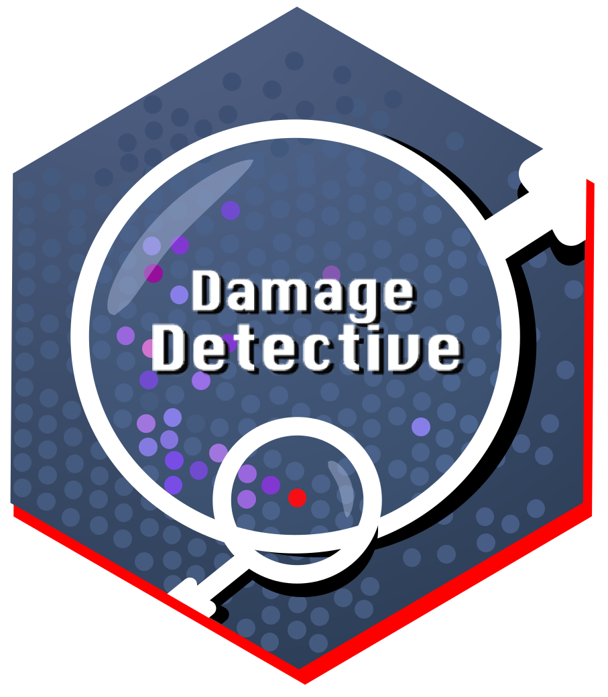
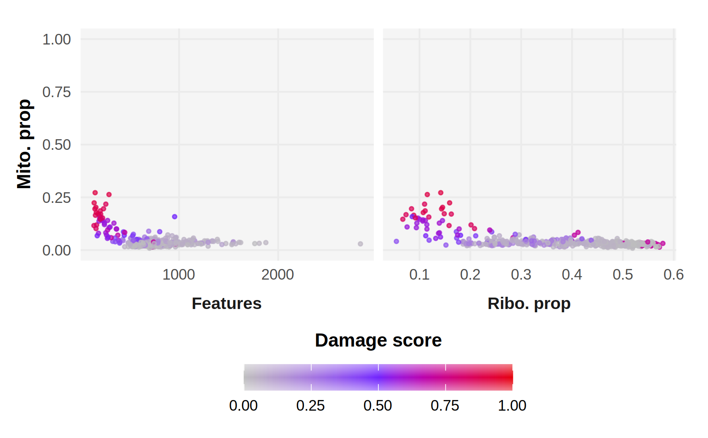

# DamageDetective 

<!-- badges: start -->

[](https://github.com/cosimameyer/overviewR/actions)  [](https://www.repostatus.org/#active) [](https://CRAN.R-project.org/package=DamageDetective)

<!-- badges: end -->

## Content

[Description](#description) \| [Installation](#installation) \| [Quick start](#quick-start) \| [Contribute](#contribute) \| [Authors](#authors) \| [License](#license) \| [References](#references)

## Description

[**Jump to the DamageDetective website**](https://alicenjoyhenning.github.io/DamageDetective/)

Damaged cells are an artifact of single-cell RNA sequencing (scRNA-seq) data formed when cells succumb to stress before, or in the process of, being sequenced. In consequence, the gene expression data captured does not reflect the cells in a biologically viable state. Continuing an analysis with damaged cells compromises its reliability as functionally relevant variability in gene expression is indistinguishable from that contributed by the damaged artifacts. Filtering damaged cells is therefore an essential step in scRNA-seq quality control (QC).

Current approaches filter damage according to deviations in cell-level QC metrics. This outlier-based detection assumes viable cells follow a unimodal distribution where deviation is synonymous with damage. However, this assumption fails in the context of heterogeneous scRNA-seq data, where QC metrics such as mitochondrial proportion and library size exhibit cell type specific distributions, and risks introducing a filtering bias relative to cell type abundance. More recent methods address this by assessing deviations within distinct distributions independently. This, however, assumes all distinct distributions are associated with viable cell populations and risks leaving abundant damage undetected. Ultimately, current filtering approaches are controlled by statistical definitions of deviation which do not always align with the biological manifestation of damage.

`DamageDetective` takes a different approach, rather than detecting damage by measuring the extent to which cells deviate from one another, it measures the extent to which cells deviate from artificially damaged profiles of themselves, simulated through the probabilistic escape of cytoplasmic RNA. This is inspired by the approach of `DoubletFinder`—a high-performing tool for filtering doublets, another prominent scRNA-seq artifact. Like `DoubletFinder`, principal component analysis is used to compute the proximity of true cells to sets of artificial cells, each with a known level of damage. The damage level of the set to which a true cell shows the highest proximity is assigned to the cell as a score ranging from 0 to 1, reflecting the proportion of cytoplasmic RNA loss in the artificial set. This score forms the main output of `DamageDetective` and provides an intuitive scale for filtering damage that is standardised across cell types, sample origin, and experimental design.

`DamageDetective` accepts count matrices, `Seurat` or `SingleCellExperiment` objects, and alignment files ([package tutorials](https://alicenjoyhenning.github.io/DamageDetective/articles/detection-vignette.html)). Though implemented in R, `DamageDetective` provides output that is platform-agnostic and can be integrated into any existing single-cell analysis workflow.

<br>

## Installation

Install `DamageDetective` from CRAN (R \>= 4.4.0),

``` r
install.packages('DamageDetective')
```

Or through GitHub (R \>= 4.4.0),

```         
library(devtools)
devtools::install_github("AlicenJoyHenning/DamageDetective", build_vignettes = TRUE)
```

To verify installation, run the following to see if you can view the package vignette and the function help pages,

``` r
library(DamageDetective)
help(package = "DamageDetective")
```

<br> <br>

## Quick start

The demonstrations below can be followed immediately after loading the package and serve as a test to ensure all is running smoothly. For more detailed examples and explanations, please refer to the package articles available on our [website](https://alicenjoyhenning.github.io/DamageDetective/).

### Prepare input

Damage detection is carried out by the `detect_damage` function and requires a count matrix to run. We will use the dummy count matrix provided by `DamageDetective`, `test_counts`, a subset of the [(kotliarov-pbmc-2020)](10.1038/s41591-020-0769-8%5D) PBMC dataset provided in the `scRNAseq`$^2$ package.

``` r
library(DamageDetective)
library(Matrix)
data("test_counts", package = "DamageDetective")
dim(test_counts)
# [1] 32738   500
```

<br>

### Select parameters for damage detection

#### `ribosome_penalty`

While `detect_damage` requires only a count matrix as input, there are optional parameters that control the implementation of the function. Of these, we recommend `ribosome_penalty` be adjusted for each dataset. This can be done automatically with `select_penalty` using the count matrix as input.

``` r
penalty <- select_penalty(
  count_matrix = test_counts,
  seed = 7
)
# Testing penalty of 1e-05...
# Testing penalty of 0.00501...
# Testing penalty of 0.01001...
# Testing penalty of 0.01501...
# Stopping early: dTNN is no longer improving.

penalty
# [1] 0.01001
```

#### `filter_threshold`

`DamageDetective` performs filtering using damage level scores and a threshold specifying the score above which cells will be filtered. This score reflects the estimated extent of damage in the cell and is taken directly from the proportion of cytoplasmic RNA loss simulated in the set of artificial cells that a true cell shows the greatest proximity to.

By default, `DamageDetective` offers the threshold of `0.7` where values greater than `0.7` reflect more permissive filtering and values closer to `0` reflect more stringent filtering. We recommend the default but suggest that if adjustments are made, they are informed by the output `detect_damage` plots, `generate_plot = TRUE`.

<br>

### Run damage detection

Damage detection is run using the count matrix and ribosomal penalty as inputs. Below we have specified `filter_counts` parameter to be `TRUE`. This will use the default `filter_threshold`, 0.7, to detect cells for removal and returns the filtered count matrix.

``` r
# Perform damage detection
detection_results <- detect_damage(
  count_matrix = test_counts,
  ribosome_penalty = penalty,
  filter_counts = TRUE,
  seed = 7
)
# Simulating 1e-05 and 0.08 RNA loss...
# Simulating 0.1 and 0.3 RNA loss...
# Simulating 0.3 and 0.5 RNA loss...
# Simulating 0.5 and 0.7 RNA loss...
# Simulating 0.7 and 0.9 RNA loss...
# Computing pANN...

# View the resulting count matrix
dim(detection_results$output)
# [1] 32738   458
```



<br>

Alternatively, if `filter_counts` is set to `FALSE`, a data frame will be given as output containing the damage scores for each barcode. This is provided for the user if they wish to interact with the `DamageDetective` results directly. From here, a user can filter their data manually, as is done by `filter_counts=TRUE` automatically.

``` r
# Perform damage detection
detection_results <- detect_damage(
  count_matrix = test_counts,
  ribosome_penalty = penalty,
  filter_counts = FALSE,
  seed = 7
)
# Simulating cells between 1e-05 and 0.08 RNA loss...
# Simulating cells between 0.1 and 0.3 RNA loss...
# Simulating cells between 0.3 and 0.5 RNA loss...
# Simulating cells between 0.5 and 0.7 RNA loss...
# Simulating cells between 0.7 and 0.9 RNA loss...
# Computing pANN...

# View output
print(head(detection_results$output), row.names = FALSE)
#                     Cells DamageDetective DamageDetective_filter
#  TCTGGAAAGCCCAACC_H1B2ln6      0.03826609                   cell
#  CCGTTCATCGTGGGAA_H1B2ln2      0.23600000                   cell
#  CTTCTCTTCAGCCTAA_H1B2ln1      0.05565522                   cell
#  GGATTACAGGGATGGG_H1B2ln1      0.01044348                   cell
#  TCTATTGTCTGGTATG_H1B2ln2      0.02435478                   cell
#  ACGGGTCAGACAAGCC_H1B2ln6      0.27600000                   cell

# Filter matrix 
undamaged_cells <- subset(detection_results$output, DamageDetective < 0.7)
filtered_matrix <- test_counts[, undamaged_cells$Cells]
dim(filtered_matrix)
# [1] 32738   458
```

## Contribute

Contributions aimed to refine or challenge the assumptions and heuristics for detecting damaged cells with `DamageDetective` are welcome, especially in the areas below,

### 💡 Conceptual Refinement

-   We base our approach on assumptions about the relationship between cell viability and cytoplasmic RNA loss apparent in single cell RNA sequencing data. If you have insights or alternate views on cell viability, feel free to start a discussion.

### 🛠 Technical Enhancement

We aim for efficiency and modularity and welcome help with, - **Sparse matrix operations**: Suggestions for improving speed or memory use—especially in R or C++—are appreciated. - **New input formats**: Want to add AnnData or other formats? Let’s collaborate!

### 🧪 Bug Reports & Features

-   Found a bug or have an idea? Please let us know!

You can reach out via the maintainer email listed below or via public discussion through the GitHub Issues tab. Active maintainer email: [alicen.jhb\@gmail.com](mailto:alicen.jhb@gmail.com){.email}

## License 

`DamageDetective` is made available for public use through the [GNU AGPL-3.0](https://opensource.org/license/agpl-v3)

## Authors 

**Alicen Henning**\
Stellenbosch University, Cape Town, South Africa\
Bioinformatics and Computational Biology

This work was done under the supervision of Prof Marlo Möller, Prof Gian van der Spuy, and Prof André Loxton.

## References 

1.  McGinnis, C. S., Murrow, L. M., & Gartner, Z. J. (2019). DoubletFinder: Doublet Detection in Single-Cell RNA Sequencing Data Using Artificial Nearest Neighbors. *Cell Systems, 8*(4), 329-337.e4. <https://doi.org/10.1016/j.cels.2019.03.003>

2.  Risso D, Cole M (2024). *scRNAseq: Collection of Public Single-Cell RNA-Seq Datasets*. <doi:10.18129/B9.bioc.scRNAseq> <https://doi.org/10.18129/B9.bioc.scRNAseq>, R package version 2.20.0, <https://bioconductor.org/packages/scRNAseq>.
