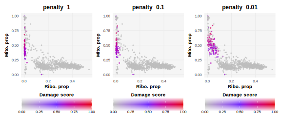
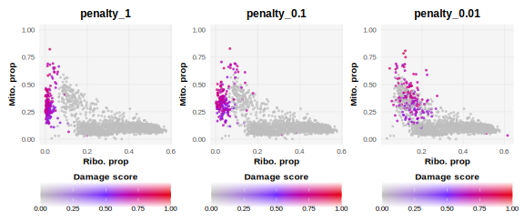
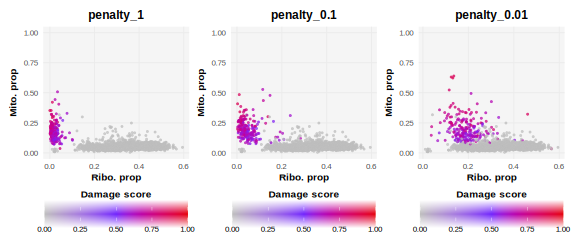
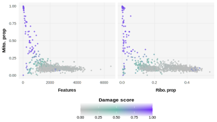
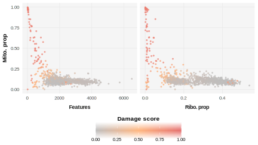

```{r setup, include = FALSE}
knitr::opts_chunk$set(
  collapse = TRUE,
  comment = "#>"
)
```

# Tutorial Overview

The goal of `DamageDetective` is to simplify the process of making informed and reproducible damaged cell filtering decisions. This tutorial provides an outline of the steps needed to achieve this:

1.  Data preparation
2.  Parameter selection
3.  Damaged cell detection

Ensure the following packages are installed and made available in your R environment to follow along:

-   `DamageDetective`, `ggplot2`, `Seurat`, `SeuratData`, `scRNAseq`, `SingleCellExperiment`, and `patchwork`.

```{r library_prep, include=FALSE, message=FALSE, warning=FALSE}
library(DamageDetective)
library(Seurat)
library(ggplot2)
library(patchwork)
```

# Data Preparation

This tutorial takes place in `R`, home to three popular scRNA-seq data storage types:

1.  The `Seurat` object
2.  The `SingleCellExperiment` (`sce`) object
3.  The matrix retrieved directly from alignment output (`matrix.mtx`, `barcodes.tsv`, and `features.tsv`).

`DamageDetective` operates with data in a compressed, column-oriented sparse matrix (`dgCMatrix`). This format efficiently handles the sparse nature of single-cell data by indexing only non-zero elements within each column. Each of the above data storage types can act as the starting point for damage detection through conversion to a sparse matrix.

> **Note:** Due to vignette size constraints, this tutorial will only  demonstrate live using data from the alignment output.

## Conversion to Sparse Matrix

### Using a `Seurat` Object

The count matrix can be extracted from the assay slot of a Seurat object. By default, this matrix is already in compressed column-oriented sparse form and can be used as input for DamageDetective.

We will use the SeuratData package to retrieve a publicly available Seurat object to demonstrate. This object stores the data from peripheral blood mononuclear cells (PBMCs) sequenced using the 10X Genomics platform.

```{r seurat_data, eval=FALSE}
# Retrieve the dataset of interest
SeuratData::InstallData("pbmc3k")
data("pbmc3k")

# Extract the count matrix
pbmc3k_counts <- pbmc3k[["RNA"]]$counts
```

### Using Alignment Output

Alignment output comes in the form of three files containing the row names (genes), column names (cell identifiers), and input values (gene expression values) of the count matrix. These can be compiled using ReadMtx, a function offered by Seurat which simplifies the count matrix compilation into one function. This involves uncompressing zipped files, mapping feature names to HGNC gene symbols, and converting the matrix to sparse format. ReadMtx output can be used directly for DamageDetective.

We will use publicly available alignment data from the 10X Genomics website for demonstration, specifically the '1k PBMCs from a healthy donor (v3)' data available here following the link named "Feature / cell matrix (filtered)".

```{r retrieve_alignment, echo=FALSE}
url <- "https://cf.10xgenomics.com/samples/cell-exp/3.0.0/pbmc_1k_v3/pbmc_1k_v3_filtered_feature_bc_matrix.tar.gz"

# Set a temporary directory
temp_dir <- tempdir()
tar_file <- file.path(tempdir(), "pbmc_1k_v3_filtered_feature_bc_matrix.tar.gz")

# Download files
download.file(url, tar_file, mode = "wb", quiet = TRUE)
untar(tar_file, exdir = temp_dir)
extracted_dir <- file.path(temp_dir, "filtered_feature_bc_matrix")
alignment_counts <- Seurat::Read10X(extracted_dir)
```

```{r demonstrate_alignment_conversion, eval=FALSE}
# Set the file paths relative to location on your device
matrix_file <- "~/Projects/demonstrations/matrix.mtx.gz"     
barcodes_file <- "~/Projects/demonstrations/barcodes.tsv.gz" 
features_file <- "~/Projects/demonstrations/features.tsv.gz" 

# Construct the sparse matrix
alignment_counts <- Seurat::ReadMtx(
  mtx = matrix_file,
  cells = barcodes_file,
  features = features_file
)
```

### Using an `sce` Object

The count matrix can be extracted from the assay slot of a Seurat object. By default, this matrix is already in compressed column-oriented sparse form and can be used as input for DamageDetective.

We will use the SeuratData package to retrieve a publicly available Seurat object to demonstrate. This object stores the data from peripheral blood mononuclear cells (PBMCs) sequenced using the 10X Genomics platform.

```{r sce_data, eval=FALSE}
# Retrieve multisample dataset
pbmc_sce <- scRNAseq::fetchDataset("kotliarov-pbmc-2020", "2024-04-18")

# Extract sample of interest
metadata <- SummarizedExperiment::colData(pbmc_sce)
sample_sce <- subset(metadata, sample == "234_d0")
sample_sce <- rownames(sample_sce)

# Subset and convert to sparse format
pbmc_counts <- SummarizedExperiment::assay(pbmc_sce, "counts")
sample_counts  <- pbmc_counts[, sample_sce]
sample_counts <- as.matrix(sample_counts)
sample_counts <- as(sample_counts, "dgCMatrix")
```

# Parameter Selection

The `detect_damage` function requires only the count matrix to run but accepts additional parameters. These parameters can be divided into two categories:

1.  **Computational Parameters**: Alter the computation and result in different outputs.
2.  **Aesthetic Parameters**: Adjust how the user receives the output but do not change the computation.

## Computational Parameters

### Dataset-Defined Parameters

-   **`organism`**: Specifies the organism of the data (default: `"Hsap"`).
-   **`annotated_celltypes`**: Indicates whether cell types are known (default: `FALSE`).
-   **`ribosome_penalty`**: Accounts for the unexpectedly low probability of ribosomal RNA loss in real single-cell data.

#### Exploring the `ribosome_penalty` parameter

This parameter accounts for the unexpectedly low probability of ribosomal RNA loss observed in real single cell data that must be accounted for during the simulation of artificial cells.

The impact of changing `ribosome_penalty` can be explored in the plots below. The idea is to see whether the artificial cells describe the true cells, in other words, whether the coloured dots superimpose the grey dots.

-   Alignment output

You will see that as you increase the penalty, i.e. go from values closer to 1 to values closer to 0$^*$, the coloured dots shift from an extreme position on the left-hand side of the plot to a more central position. At what point along this range true cells exist is dataset-dependent but generally lies closer to 0.

> $^*$ ribosome_penalty is a multiplicative reduction factor meaning a value of 1 is the same as introducing no penalty while values increasingly closer to zero introduce increasingly greater reductions.


-   `sce` output

The same can be seen using the counts extracted from the `sce` object.


-   `Seurat` output

In the case of the `Seurat` object, we see little overlap between coloured and grey dots. This is because, unlike the data from alignment and the `sce` object, the `Seurat` object contains filtered counts where damaged cells have already been removed. Since we do not expect to see any damaged cells, we do not expect to see simulated damage cells matching any of the true cells. In this case, the choice of `ribosome_penalty` is not as important.


<br>

Plots like those shown above can be generated as follows where,

-   `count_matrix` requires your data in sparse matrix form

-   `ribosome_penalty` is a numeric between 0 and 1 specifying the ribosomal penalty

-   `damage_proportion` is a number between 0 and 1 specifying the amount of artificial cells to create relative to the input data (*setting this to a lower value makes the computation faster*)

-   `target_damage` is a vector specifying the lower and upper levels of damage between which the artificial cells are generated. Shifting this to higher values shifts the damaged cell profiles to more intense levels that can be seen by a shift in colour, more red, as well as a shift in position, higher up on the y axis.

-   `plot_ribosomal_penalty` allows the plot to focus on the ribosomal proportion rather than give a general overview of the QC distributions.

-   `seed` ensures the output can be reproduced.

```{r view_penalty}
#| fig.alt: >
#|   Scatter plot showing the distribution of quality control 
#|   metrics in altered and unaltered counts. 
penalty_plot <- DamageDetective::simulate_counts(
  count_matrix = alignment_counts,
  ribosome_penalty = 0.01,  
  damage_proportion = 0.05,  
  target_damage = c(0.5, 1), 
  plot_ribosomal_penalty = TRUE,
  seed = 7
)
```


<br>

### Computing the Ideal `ribosome_penalty`

From the above plots you can see how selecting an unideal \`ribosome_penalty\` can generate damaged profiles that do not describe the data well and, as a result, generate estimations of damage that do not describe the data well.

Selecting a \`ribosome_penalty\` that simulates RNA loss in a way that is relevant to the input data can be done as shown above, through trial and error, or in an automated fashion using the \`select_penalty\` function,

-   `penalty_range` setting a specific range of `ribosome_penalty` estimates

-   `max_penalty_trials` set a maximum number of attempts allowed

-   `penalty_step` setting the difference between each estimate

-   `return_output` returns a table showing the mean distances for each estimate giving a better idea of how the estimates differ.

It also inherits parameters of the `simulate_counts` function above including `damage_proportion`.

```{r select_penalty}
selected_penalty <- DamageDetective::select_penalty(
  count_matrix = alignment_counts,
  max_penalty_trials = 2, # shortened for vignette, default is 10
  seed = 7, 
  verbose = TRUE
)
selected_penalty
```

The output above reveals that the `select_penalty` function runs through trial and error. This involves generating artificial cells using different `ribosome_penalty` estimates and evaluating the similarity of the resulting artificial cells to true cells.

Here, 'similarity' refers to the shortest distance from each artificial cell to a true cell in principal component (PC) space. The mean shortest distances are taken for each level of damage simulated. The penalty that generates the smallest mean shortest distance across damage levels is selected as the ideal `ribosome_penalty`. In other words, a penalty that generates artificial cells that are the most similar to true cells over a wide range of damage levels is ideal.

Though not strictly necessary, the `select_penalty` function can be adjusted to give a user more control over the testing process. This includes,

-   `penalty_range` setting a specific range of `ribosome_penalty` estimates

-   `max_penalty_trials` set a maximum number of attempts allowed

-   `penalty_step` setting the difference between each estimate

-   `return_output` returns a table showing the mean distances for each estimate giving a better idea of how the estimates differ.

It also inherits parameters of the `simulate_counts` function above including `damage_proportion`.

### Undefined Computational Parameters

The remainder of the computational parameters involve selections that cannot be determined directly from the dataset and are up to user discretion. To support this, it may be helpful for a user to understand how the `detect_damage` function works.

Ultimately, `detect_damage` outputs a score from 0 to 1 indicating the estimated damage level in each cell. This is found by comparing the cells to simulated cells where the extent of damage is known.

Damage is simulated by the loss of cytoplasmic RNA, a consequence that follows from a loss in plasma membrane integrity-a defining principle of damage used in many cell viability assays. `DamageDetective` assumes that the proportion of RNA lost is directly related to the extent of cellular damage.

In a complementary workflow to that of `select_penalty`, `detect_damage` estimates the damage level of each true cell by measuring its similarity to artificially damaged cells. Using the PC embeddings, a set of cells with the highest similarity to each true cell, the nearest neighbours (NN), is collected. The proportions of nearest neighbours that originate from damage level are found. The damage level of the artificial set to which the true cell shows the highest proportion of nearest neighbours is selected as the cell's estimated damage level. This is scaled to score the cells in each set in a way that reflects the relative differences in proportion.

Now, looking at the parameters:

-   **`filter_threshold`**

A value between 0 and 1 to determine the level of damage, or proportion of RNA loss, above which cells will be excluded. By default, `DamageDetective` offers the threshold of `0.7`. Values greater than `0.7` reflect more permissive filtering while those closer to `0` reflect more stringent filtering. We recommend the default for all cases but suggest that if adjustments are made, they are informed by inspecting the output `detect_damage` plots, `generate_plot = TRUE`.

-   **`damage_levels`**

This describes the number of distinct sets of artificial cells simulated, each with a defined level of damage. This parameter requires a balance between generating enough damage sets to give informative estimates of damage i.e. not 0 to 1, and not putting the computation under strain by creating redundant sets.

Of the default options, we find 5 sets strikes an ideal balance. Going above 5 becomes computationally challenging but could be done for small datasets. Going below 5, while not ideal, may be necessary for large datasets (over 10 000 cells).

While shifting from the default options is not recommended, it is possible should a user feel it necessary through specification in a list,

```{r eval = FALSE}
damage_levels = list(
  pANN_50 = c(0.1, 0.5),
  pANN_100 = c(0.5, 1)
)
```

-   **`kN`**

This describes the size of the set of nearest neighbours that is found for each true cell. This value defaults to a fifth of the size of the input dataset. This parameter is not as essential as others since changes made here introduce change to all artificial cells in a relative way.

It should be noted that increasing the size of the set too greatly increases the computational requirements of the function and have not been found to dircetly improve output. For this reason, anything greater than a third of the size of the input data is discouraged.

<br>

## Aesthetic Parameters

-   **`filter_counts`**: Determines the output format (filtered matrix or dataframe).
-   **`palette`**: Sets the color palette for damaged cells in plots.
    -   Purple, blue: c("grey", "#6AB6AB", "#7023FD")\
        

    -   Orange, red: c("grey", "#FFB67F", "#E56E6E")

        

# Damaged Cell Detection

Once the data is in sparse matrix form and an appropriate `ribosome_penalty` is selected, the `detect_damage` function can be run.

```{r run_detection}
#| fig.alt: >
#|   Scatter plot showing the outcome damage detection where
#|   cells of the input data are coloured according to the
#|   estimated level of damage with grey being no damage, 
#|   purple being light damage, and red being heavy damage.
# Run detection
detection_output <- DamageDetective::detect_damage(
  count_matrix = alignment_counts, 
  ribosome_penalty = selected_penalty,
  seed = 7
)

# View output
head(detection_output$output[, -1])
table(detection_output$output$DamageDetective_filter)

```

# Session Information

```{r session-info, echo=FALSE}
sessionInfo()
```

# References

-   Amezquita R, et al. (2020). "Orchestrating single-cell analysis with Bioconductor." *Nature Methods*, *17*, 137-145.
-   Hao et al. (2023). *Seurat V5*. Nature Biotechnology.
-   Satija R, et al. (2025). *SeuratData: Install and Manage Seurat Datasets*. R package version 0.2.2.9002.
-   Pedersen T (2024). *patchwork: The Composer of Plots*. R package version 1.3.0.
-   Wickham. *ggplot2: Elegant Graphics for Data Analysis*. Springer-Verlag New York, 2016.
